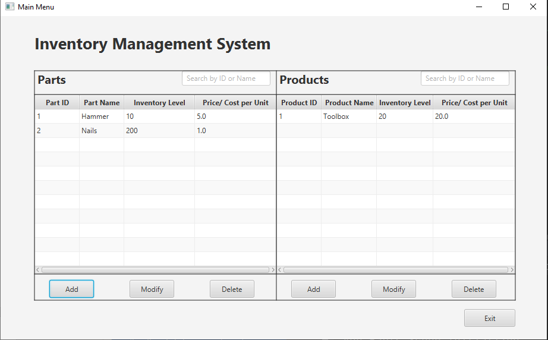
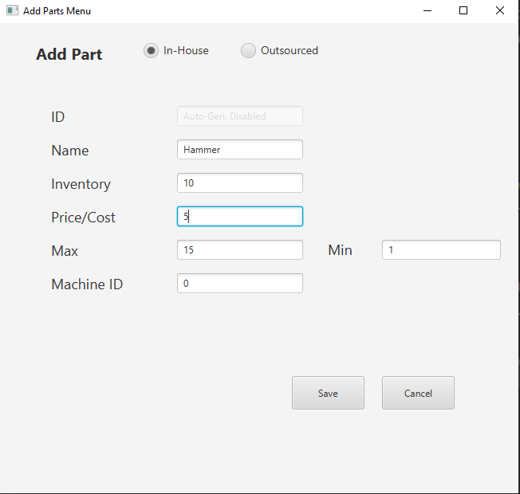
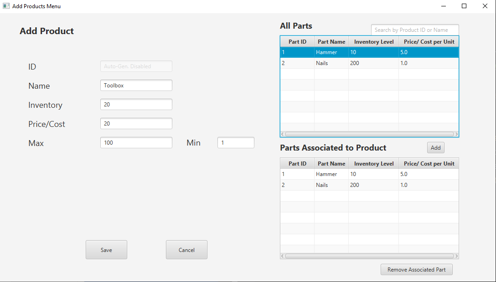
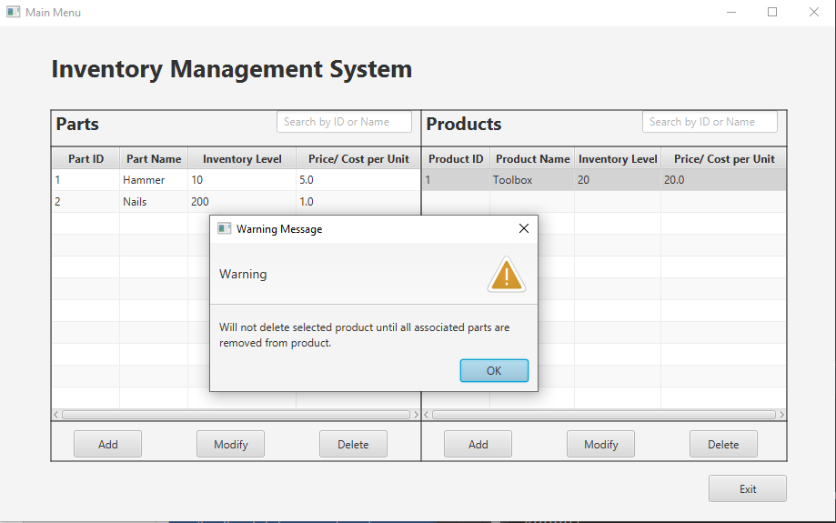

# ProductInventoryApp

<h2>Description</h2>
A fully functional windows application that stores and displays parts and product information.

<h2>Languages and Framework</h2>
<li>Java 17.0.4</li>
<li>JavaFX 17.0.2</li>

<h2>Build Tools</h2>
<li>Maven</li>

<h2>Environments Used</h2>
<li>Intellij IDEA 2022.2.1</li>
<li>Windows 10</li>

<h2>Application Screenshots</h2>

Main Menu

Add Part

Add Product

Delete Restrictions

